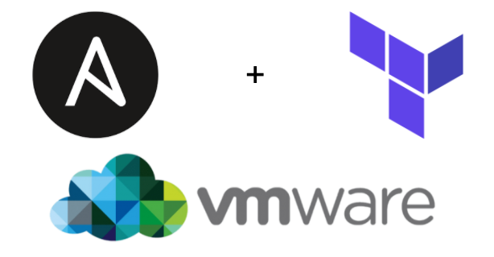

# Terraform-Vsphere-Ansible

 

## Published articles:

 - [Terraform Tutorial - Part 1 - Create Jenkins with terraform and ansible]()

 - [Terraform Tutorial - Part 2 - Create Docker with terraform and ansible]()

 - [Terraform Tutorial - Part 3 - Create Elasticsearch with terraform and ansible]()

 - [Terraform Tutorial - Part 4 - Create Grafana with terraform and ansible]()

## Contributions:

All contributions are welcomed. Help me to enrich this repository.

If you find any **bugs** in the examples, please file an issue.

### TODO:

 - [ ] Adding Prometheus
 - [ ] Adding consul
 - [ ] Adding vault
